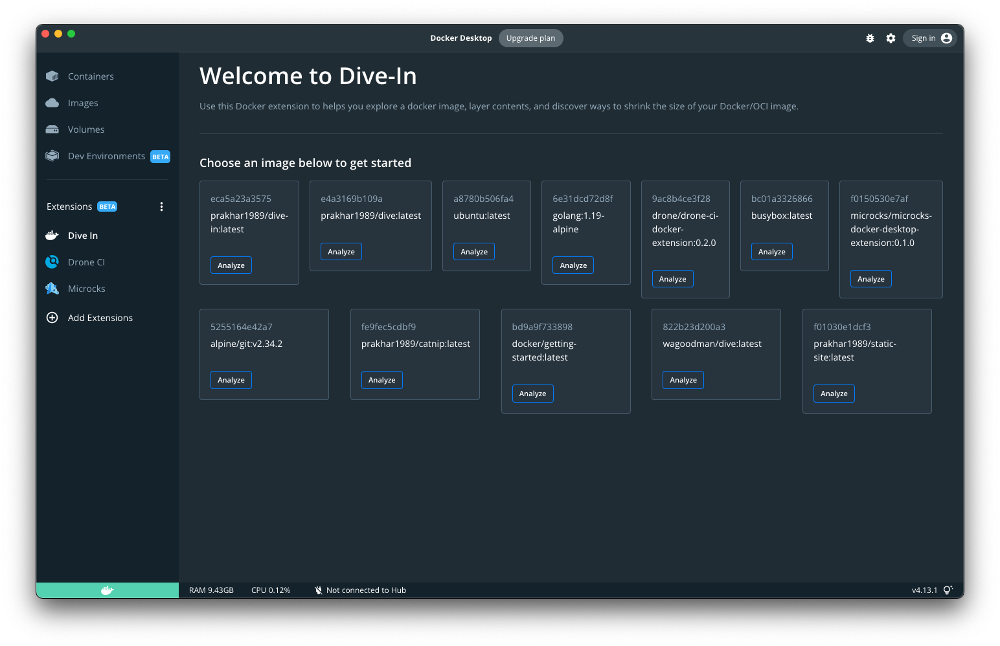
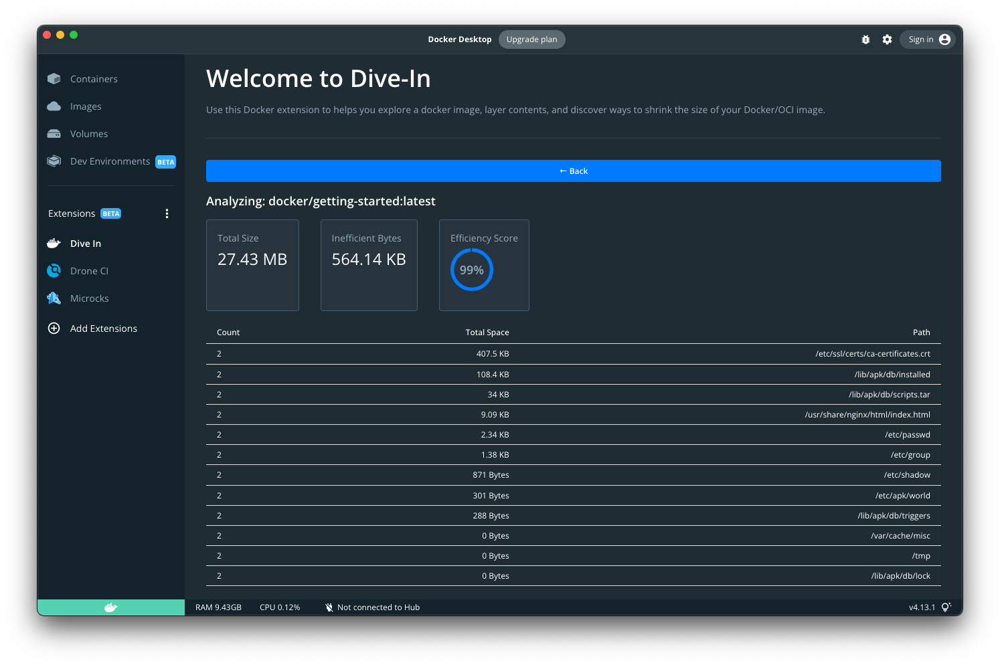

# Dive In

A Docker extension that helps you explore a docker image, layer contents, and discover ways to shrink the size of your Docker/OCI image.

Built on the top of excellent CLI tool - https://github.com/wagoodman/dive




## Installation

Make sure your Docker desktop supports extensions. This extension can be installed from [Docker Hub] (https://hub.docker.com/extensions/prakhar1989/dive-in) or in Docker Desktop. 

## Development

Go through [the official docs](https://docs.docker.com/desktop/extensions-sdk/quickstart/) to understand the basic setting up of the Docker extension.

Useful commands for setting up debugging

```
$ docker extension dev debug prakhar1989/dive-in
$ docker extension dev ui-source prakhar1989/dive-in http://localhost:3000
```

Make sure you run `npm run start` in the `ui/` folder.
